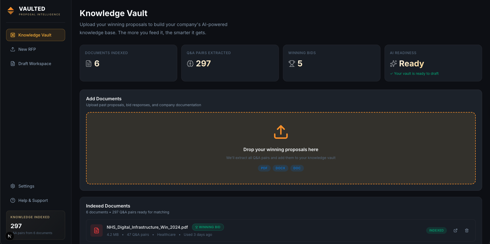
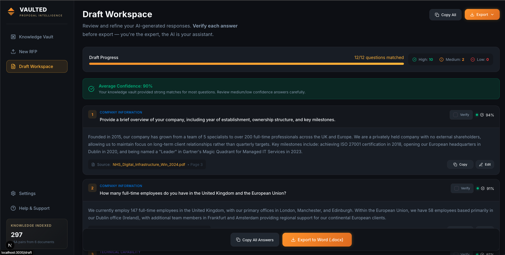

# Vaulted | Proposal Intelligence

**Turn your winning proposals into an AI-powered knowledge vault. Draft RFP responses 10x faster.**


---

## 🎯 What is Vaulted?

Vaulted transforms your past winning proposals into an intelligent knowledge base that automatically drafts responses to new RFPs (Requests for Proposal). Built for Bid Managers who spend 70% of their time searching through old documents for answers they've already written.

**The Problem:** Bid Managers receive 60-page RFPs with 100+ questions, where 80% have been answered before. Finding those answers across scattered PDFs and Word docs takes days.

**The Solution:** Vaulted indexes your past proposals, extracts Q&A pairs, and uses semantic search to match new questions with your best past answers — complete with source citations and confidence scores.

---

## ✨ Key Features

### 🔐 Human-in-the-Loop Trust
- **Verify Checkbox**: Approve each AI-generated answer before export
- **Edit Timestamps**: Track when answers were manually reviewed
- **Source Citations**: Every answer shows the exact document and page number
- **Confidence Scores**: 74%-98% confidence indicators with visual feedback

### 🏆 Premium Enterprise Design
- **Dark Navy + Gold**: Professional B2B SaaS aesthetic
- **Geometric Logo**: Minimalist vault diamond (secure container opening)
- **Winning Bid Badges**: Highlights answers from successful proposals
- **Export to Word**: Industry-standard .docx format for final submissions

### 🧠 Intelligent Workflow
1. **Knowledge Vault**: Upload past winning proposals (PDF/DOCX)
2. **RFP Upload**: Process new RFPs and extract questions
3. **Draft Workspace**: Review AI-generated answers with citations

---

## 🛠 Tech Stack

| Layer | Technology |
|-------|-----------|
| Framework | Next.js 14 (App Router) |
| Language | TypeScript |
| Styling | Vanilla CSS with CSS Variables |
| Icons | Lucide React |
| Fonts | Inter + Playfair Display (Google Fonts) |
| Deployment | Vercel-ready |

---

## 🚀 Getting Started

### Prerequisites
- Node.js 18+ and npm

### Installation

```bash
# Clone the repository
git clone https://github.com/yourusername/vaulted.git
cd vaulted

# Install dependencies
npm install

# Run the development server
npm run dev
```

Open [http://localhost:3000](http://localhost:3000) to view the app.

---

## 📁 Project Structure

```
rfp-brain/
├── public/
│   └── favicon.svg          # Geometric vault logo
├── src/
│   ├── app/
│   │   ├── globals.css      # Navy + Gold design system
│   │   ├── layout.tsx       # SEO metadata
│   │   ├── vault/           # Screen 1: Knowledge Vault
│   │   ├── upload/          # Screen 2: RFP Upload
│   │   └── draft/           # Screen 3: Draft Workspace
│   ├── components/
│   │   ├── layout/
│   │   │   └── Sidebar.tsx  # Navigation with branding
│   │   ├── ui/
│   │   │   └── FileUpload.tsx
│   │   └── features/
│   │       ├── DocumentList.tsx
│   │       └── AnswerCard.tsx  # Human-in-the-loop features
│   └── data/
│       └── mockData.ts      # Realistic RFP demo data
```

---

## 🎨 Design System

**Color Palette:**
- Background: Deep Navy (`#0a0c14`)
- Accent: Matte Gold (`#f59e0b`, `#fbbf24`, `#d97706`)
- Text: Light Grey (`#f8fafc`) / Secondary (`#94a3b8`)

**Typography:**
- Logo: Playfair Display (serif)
- UI: Inter (sans-serif)

---

## 🌐 Live Demo

Visit: [vaultedproposals.com](https://vaultedproposals.com)

---

## 💼 Business Model

**Target Market:** Bid Managers at 20-100 employee firms in:
- Civil Engineering
- IT Consulting
- Security Services
- Professional Services

**Pricing:** $299/month for up to 3 users (founding member tier)

---

## 🔒 Security & Privacy

- **Encrypted Storage**: End-to-end encryption for all proposal data
- **Local Embeddings**: Semantic search happens locally (data never leaves your infrastructure during matching)
- **No Training**: Your data is never used to train AI models
- **Audit Logs**: Full compliance tracking for enterprise requirements

---

## 📸 Screenshots

### Knowledge Vault


### Draft Workspace


> **Tip for Images**: To use these in your code, place them in `public/imgs/` and reference them with `/imgs/filename.png`. In Markdown/GitHub, use the relative path `public/imgs/filename.png` as shown above.

---

## 🛣️ Roadmap

**Current (Demo MVP):**
- ✅ 3-screen clickable prototype
- ✅ Mock data with realistic RFP questions
- ✅ Human-in-the-loop verification UI
- ✅ Premium branding

**Next (Production Backend):**
- [ ] LlamaParse for PDF extraction
- [ ] Pinecone vector database
- [ ] Claude 3.5 Sonnet for answer generation
- [ ] User authentication (Clerk/Auth0)
- [ ] Multi-tenant architecture

**Future:**
- [ ] Real-time collaboration
- [ ] Compliance templates (ISO, SOC2)
- [ ] API integrations (SharePoint, Google Drive)

---

## 🤝 Contributing

This is currently a private beta project. If you're interested in contributing or testing, please reach out.

---

## 📄 License

Proprietary - All Rights Reserved

---

## 📞 Contact

- Website: [vaultedproposals.com](https://vaultedproposals.com)
- Product: Vaulted | Proposal Intelligence
- Tagline: *Turn past wins into future revenue*

---

**Built for Bid Managers who deserve better tools.**
